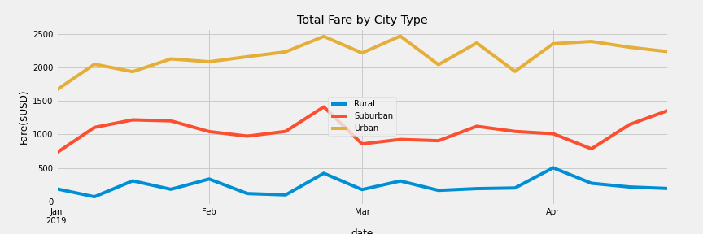
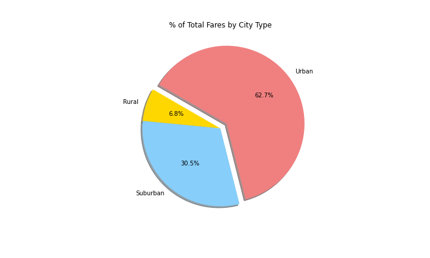

# PyBer_Analysis
Analyze all the rideshare data from January to early May of 2019 and create a compelling visualization
## **Overview**
The following analysis is performed on a  ride sharing dataset. A variety of charts were created to showcase the relationship between the types of cities (Urban, Suburban, and Rural) and the number of drivers and riders as well as the percentage of total fares, riders, drivers by types of cities in order to help the company improve access to ride-sharing services and determine affordability for inadequately serviced neighborhoods. 

## **Results**
Through our analysis we have found the following facts:
 1.  The total number of rides per city type was 125, 625, and 1625 for Rural, Suburban, and Urban cities, respectively. Which shows that there is a difference of 1500 more rides in Urban cities compared to rural.  
 2.  The total number of drivers for each city type was 78, 490, and 2405 for Rural, Suburban, and Urban cities, respectively.
 3.  The total amount of fares for each city type was \$4327, \$19356, and \$39854 for Rural, Suburban, and Urban cities, respectively. It is obvious that most of the profit comes from the Urban cities which factors in 63% of the total fare income.
 4.  The average fare per ride was \$34.62, \$30.97, and \$24.52 for Rural, Suburban, and Urban cities, respectively. We can infer that because there are more drivers and users in Urban cities, the average fare price is lower. 
 5.  The average fare per driver was \$55.49, \$39.50, and \$16.57 for Rural, Suburban, and Urban cities, respectively.
 6.  The following images show a summary of all the data collected by city type. 
   
 
 ***Image 1- Data Summary***

***Image 2 - Total Fare by City Type***
## Summary
1. The data summary shows that the Rural cities are being underserved because the number of drivers is so low, the average fare price per ride is almost \$10 more compared to Rural cities and almost \$7 compared to Suburban cities. Therefore it is recommended to increase the number of drivers to best serve costumers and offset the diffence in price. 
   
2. The following box-and-whisker plot shows the Ride Count Data by each city type.

We can observe that the average number of rides in Rural cities is 4 and 3.5 times lower compared to Urban and Suburban. It is advised to come up with a strategy to engage more people with the ride sharing service provided. A good idea would be advertising.  

3. The following pie chart showcases the percentage of Total Fares by City Type. 

Evidently, the main source of income are Urban cities which represent 62.7% of the total revenue. And it's not surprising that the Rural cities only factor in a low percentage of that total. We are only making 6.8% percent of the total income in Rural cities. Based on this numbers we strongly reccomend performing a deeper study in rural areas in order to determine whether the people are not using the service because it is too pricy or they prefer to drive their own cars instead or because of the limited number of drivers the wait times are too high and discouraging. 

